# Android中的Shadowsocks客户端

> #### info:: 详细过程见单独帖子
>
> 更多细节详见：[【记录】安装和使用支持chacha20-ietf-poly1305的Android的shadowsocks客户端 – 在路上](https://www.crifan.com/install_and_use_android_shadowsocks_client_support_chacha20_ietf_poly1305/)
>
> 下面把关键步骤整理如下供参考。

## 下载和安装

两种方式：

* 自己去`github`下载`apk`安装包后自己安装
  * 去[Releases · shadowsocks/shadowsocks-android](https://github.com/shadowsocks/shadowsocks-android/releases) 可以下载到apk，比如：[shadowsocks--universal-4.6.5.apk](https://github.com/shadowsocks/shadowsocks-android/releases/download/v4.6.5/shadowsocks--universal-4.6.5.apk)：
  * 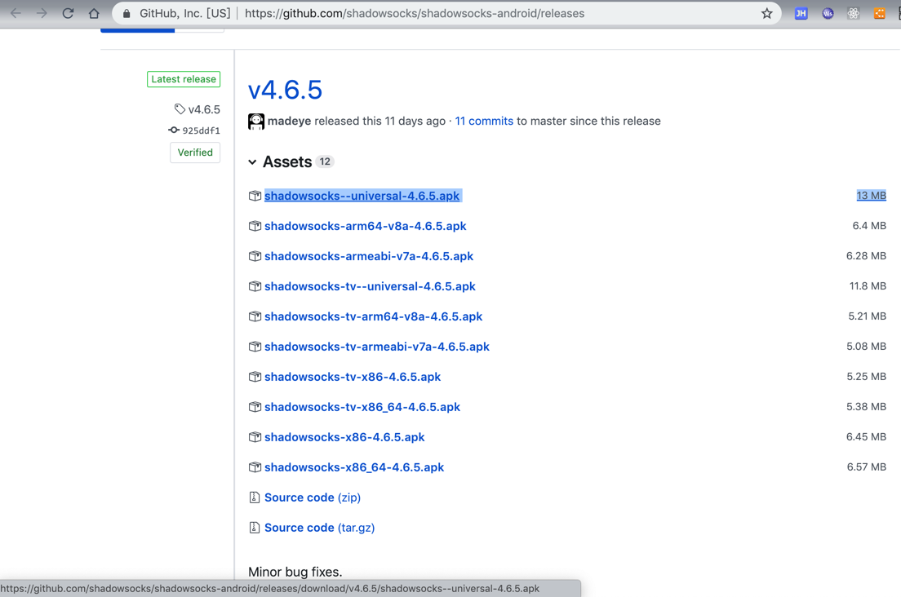
  * 然后安装到Android手机中即可：
  * 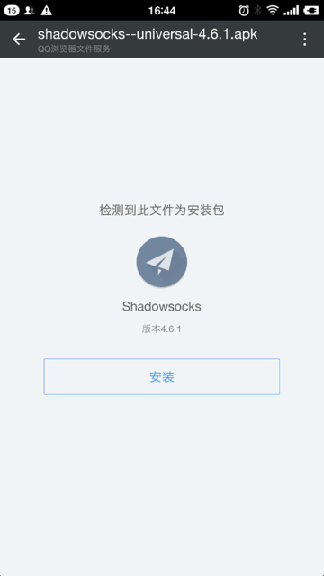
* 从应用市场`Google Play`去搜索并安装
  * [Shadowsocks - Android Apps on Google Play](https://play.google.com/store/apps/details?id=com.github.shadowsocks)

## 添加配置

打开ss客户端，然后去添加服务器节点的配置，主要是去配置服务器的`地址`，`端口`，`密码`，`加密方式`等内容。

> #### info:: 对ss的配置不熟悉的可参考`通用的逻辑`
>
> 各种ss的客户端的配置的逻辑都是一样的，如果不清楚可去参考：[ss客户端的通用逻辑 · 科学上网相关知识总结](https://book.crifan.com/books/scientific_network_summary/website/server_client_mode/ss_client/client_common_logic.html)

此处点击右上角的加号`➕`：

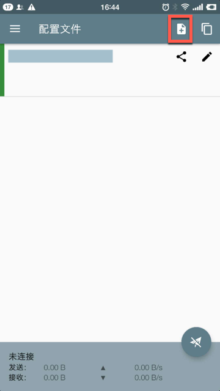

会显示出3种方式：

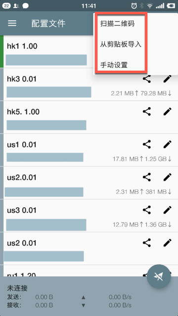

* `扫描二维码`：扫描二维码后自动解析并添加配置
* `从剪贴板导入`：一般是从别处拷贝了对应服务器配置的字符串，然后再来此处粘贴。
  * 自己很少用到此方式
* `手动设置`：自动手动填写配置信息
  * 虽然稍微麻烦点，但是最通用

一般来说，推荐`扫码`添加，因为很方便

-》 但是下面会解释此处安卓中由于扫码需要`Google Play`而导致死循环，而不方便扫码

-》 所以此处推荐`手动添加`

不过先说说如果要扫码，如何操作：

### 扫码添加配置

在扫描之前，先要有二维码可以扫，比如之前提到的[购买 shadowsocks.nu 的ss服务](https://book.crifan.com/books/scientific_network_summary/website/server_client_mode/ss_server/buy_ss_service/shadowsocks_la.html)，购买后去后台配置页面中可以找到二维码。

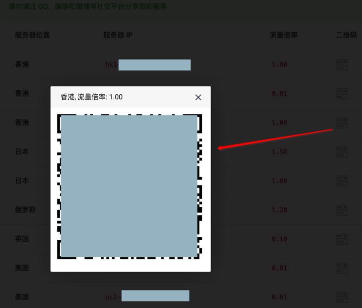

> #### warning:: 安卓扫码添加配置需要更新Google Play服务
>
> 此处实践发现，安卓端扫码去添加配置：
> 
> 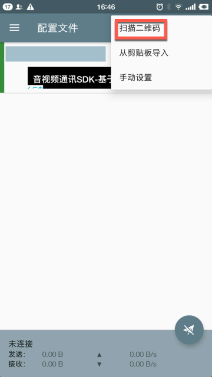
> 
> 竟然会出现提示：`更新Google Play服务，您必须先更新Google Play服务，然后才能运行shadowsocks`
> 
> 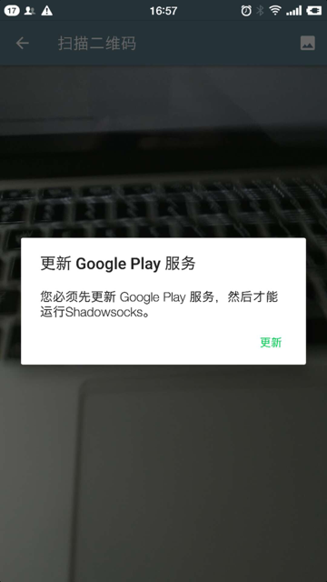
>
> 而`Google Play服务`本身，却又需要翻墙才能更新，而此处就是要去翻墙，导致死循环了，所以此路暂时不通。

### 手动添加配置

所以此处为了能正常添加配置，建议用`手动设置`的方式去添加ss服务器配置。

点击`手动配置`后，填写如下信息：

* ss服务的配置：
  * `配置名称`：可选，比如填写`hk1 1.00`，表示节点名和流量费率，方便区分不同节点
  * `服务器`：ss服务器的地址
  * `远程端口`：ss服务器的端口
  * `密码`：ss的密码
    * 自建ss服务器或者购买的ss服务器，都会提供相关密码给你的
  * `加密方式`：比如最新的：`chacha20-ietf-poly1305`
    * 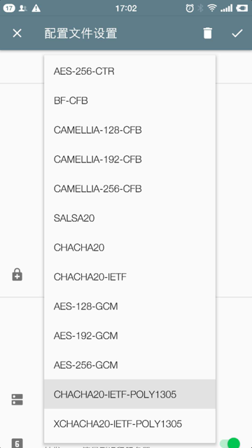
* 其他软件的配置
  * `路由`：默认是`全局`，建议改为：`绕过局域网和中国大陆地址`
    * 

填写配置后如下：

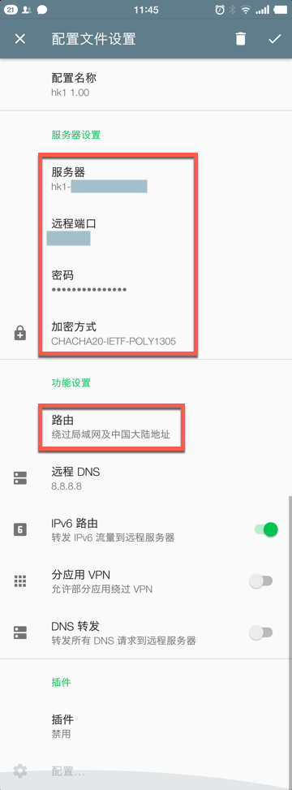

按照同样方式，去添加其他节点的服务器配置。

### 开始使用

点击`选中`某个服务器节点（左边会有竖向的绿色提示），点击右下角`纸飞机按钮`去连接，连接后：

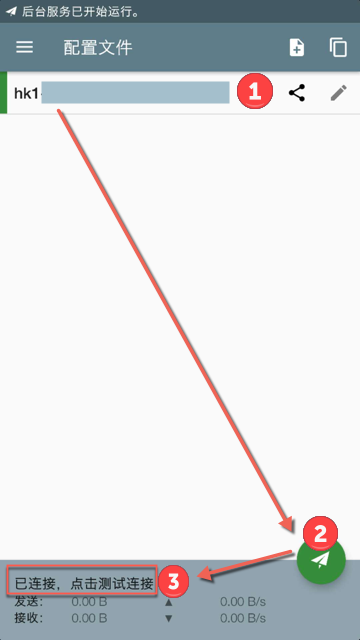

点击`已连接，点击测试连接`去测试速度如何：

就表示可以使用了，同时系统通知中也会有VPN和流量的提示：

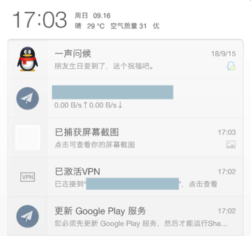

然后就可以愉快的科学上网了，比如：

去用`youtube`看视频：

去用手机浏览器上`google`查资料：

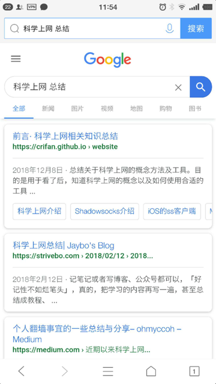
