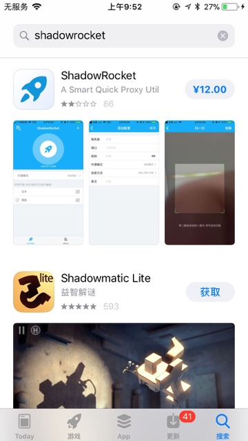
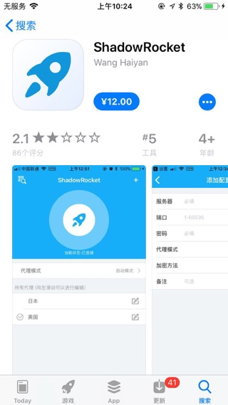
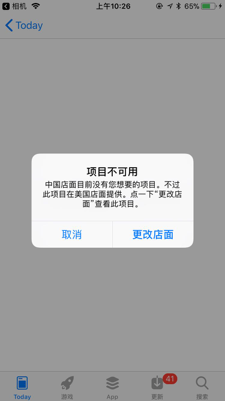
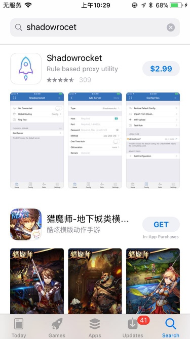
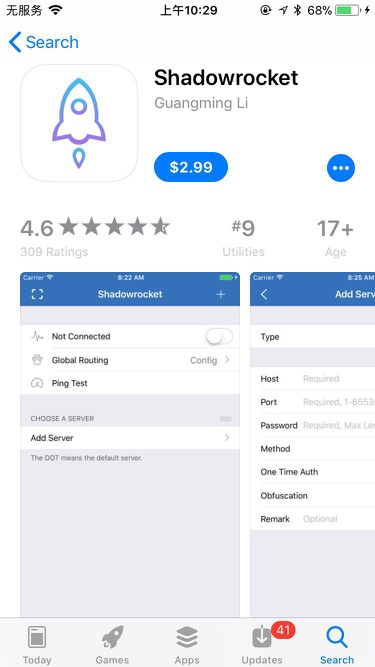
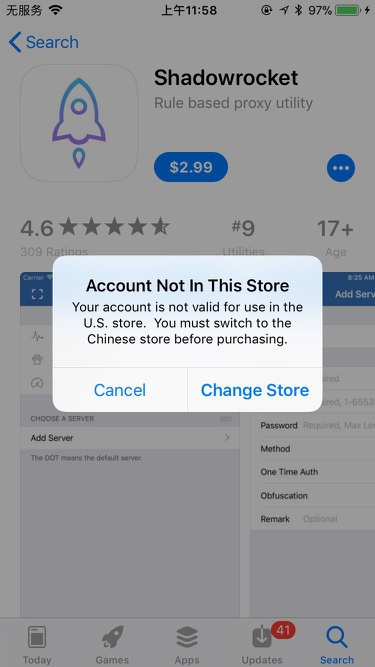
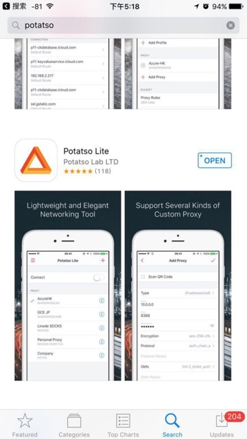

# iOS中的Shadowsocks客户端

iOS中的Shadowsocks客户端，也有多种。

可以参考Shadowsocks官网中：[Shadowsocks - Clients](https://shadowsocks.org/en/download/clients.html)介绍的：

* Wingy：
  * [App Store](https://itunes.apple.com/us/app/wingy-http-s-socks5-proxy-utility/id1178584911)
* MobileShadowSocks
  * [Big Boss](http://apt.thebigboss.org/onepackage.php?bundleid=com.linusyang.shadowsocks)

不过想要使用支持最新加密方式`chacha20-ietf-poly1305`的客户端的话，目前只有这几个：

## iOS的ss客户端：`shadowrocket`

## 评分低的`Wang Haiyan`的shadowrocket

国内账号的AppleID登录后的国内AppStore可以搜索到

不过貌似看了下，评分只有**2.8分**，很差啊：

难道不是原版？然后注意到作者是：`Wang Haiyan`

## 评分高的`Guangming Li`的shadowrocket

而后来去google搜到的是：`Guangming Li`的[Shadowrocket on the App Store](https://itunes.apple.com/us/app/shadowrocket/id932747118?mt=8)，评分很高：**4.6分**，估计是才是正版。

用iPhone的相机去扫码页面二维码，打开后，跳转到AppStore中，但是提示：

> **项目不可用**
>
> 中国店面目前没有您想要的项目。不过此项目在美国店面提供。点一下"更改店面"查看此项目。

然后点击`更改店面`，去看看效果，竟然还真能直接切换AppStore的地区，然后可以搜索到，看起来是正宗的`shadowrocket`了：

本来打算去安装试试效果，发现要收费**$2.99**，所以还是算了。

不过点击后发现，好像没法买`Account Not in This Store`：

所以，虽然AppStore可以自动帮你切换地区，但是如果你的苹果账号AppleID不是美国的，还是无法下载此处正宗美国版的shadowrocket。还是需要美国的AppleID才可以下载和安装。

## iOS的ss客户端：`Potatso`/`Potatso Lite`

国内账号的AppleID登录后的国内AppStore搜索不到

估计是被国家和谐了，不允许上架到国内的AppStore市场

### 如何才能从iPhone的AppStore中搜索并下载到Potatso？

网友提供了一些方式，供参考：

* 把AppleID的`国家/地区`设置成`加拿大`，支付方式选择`none`，设置成其它国家也可以，但是可能需要有当地的信用卡才行。然后下载potatso lite，只有这是免费的，可以不用支付。下载完成后把国家地区设置回来即可。
* 去淘宝买个其他国家appple id，然后再去美国的app store就可以下载了Potatso
  * 
* 见过别人用`iPhone`+`自己的国外的appleid`，在AppStore上可以搜到potatso，然后就可以下载并安装，然后扫描添加服务器配置后，就可以正常翻墙了
