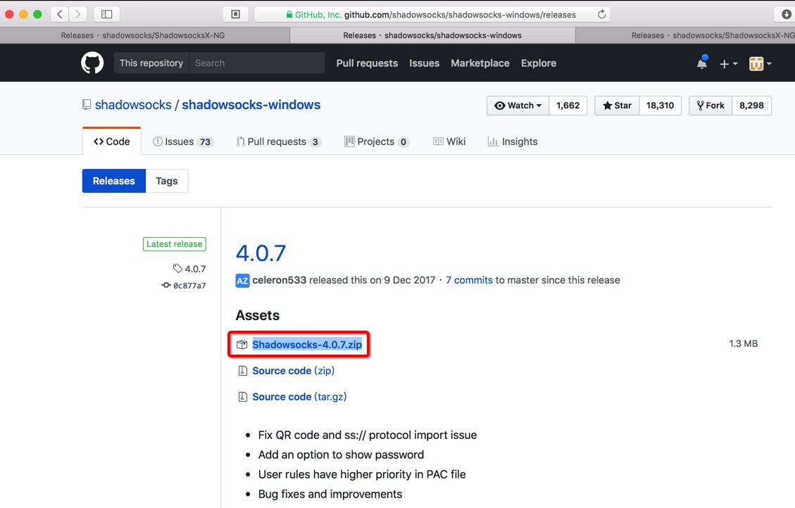

# Windows中的Shadowsocks客户端

## Windows版ss客户端：Shadowsocks.exe

### 下载和安装Shadowsocks.exe

Winddows中的ss客户端，有多种，常用的是：

去github官网 :

[Releases · shadowsocks/shadowsocks-windows · GitHub](https://github.com/shadowsocks/shadowsocks-windows/releases)

点击下载最新的Windows的客户端：

解压缩下载得到的zip文件后，即可得到exe可执行文件，无需额外安装，双击即可打开使用。

### 使用Win版Shadowsocks.exe实现科学上网

Win版Shadowsocks的功能，其实和后面要介绍的**Mac版ss客户端：ShadowsocksX-NG**的用法，基本上是一样的。所以可以具体用法可以参考后面的`ShadowsocksX-NG`。

TODO：抽空添加更详细的Windows版Shadowsocks的用法。
