# Mac中的Shadowsocks客户端

Mac下的Shadowsocks客户端也有不止一个。

用过的有：

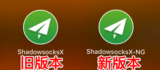

* `ShadowsocksX`
  * 对应下载地址是：[ShadowsocksX-2.6.3.dmg]([https://github.com/shadowsocks/shadowsocks-iOS/releases/download/2.6.3/ShadowsocksX-2.6.3.dmg])
* `ShadowsocksX-NG`
  * 之所以换用ShadowsocksX-NG：
    * 后来在shadowsocks.to改用新加密算法`chacha20-ietf-poly1305`后，而ShadowsocksX不支持，所以才换用`ShadowsocksX-NG`的。

两个版本的功能和使用方式，基本上没太大区别。

下面主要来介绍ShadowsocksX-NG的使用。

## Mac版ss客户端：ShadowsocksX-NG

### 下载和安装ShadowsocksX-NG

从Github中下载：[Releases · shadowsocks/ShadowsocksX-NG](https://github.com/shadowsocks/ShadowsocksX-NG/releases)

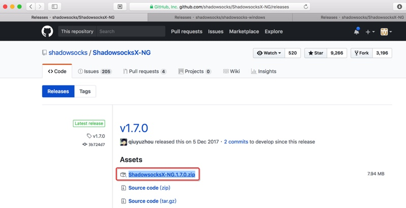

解压下载得到的`ShadowsocksX-NG.1.7.0.zip`得到app文件：`ShadowsocksX-NG.app`

把ShadowsocksX-NG.app拖动到应用程序Application文件夹，即可：

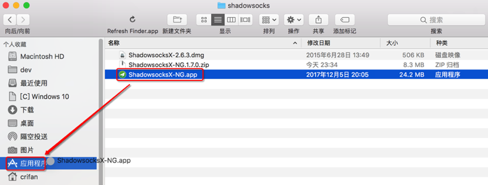

## 运行ShadowsocksX-NG

安装后，从LaunchPad中：

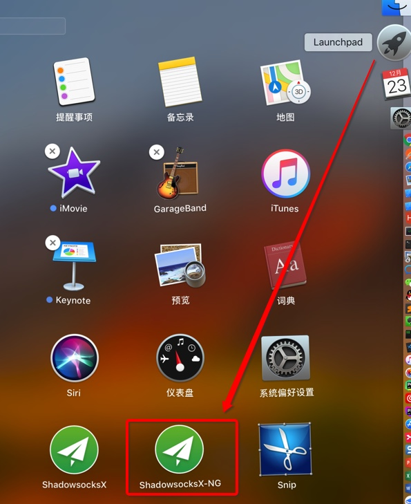

或从 应用程序中也可以找到：

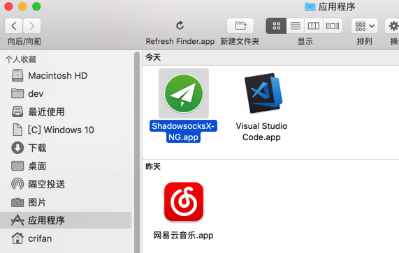

Shadowsocks-NG，点击以启动：

当前Shadowsocks-NG的版本是最新的1.7.0:

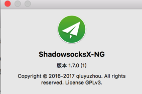

## ShadowsocksX-NG中添加服务器配置信息

如之前介绍，有三种办法添加ss服务器的配置信息：

* 一次性导入json配置文件
  * 可以添加所有的服务器配置
* 通过扫描二维码添加
  * 只能一个个添加服务器
* 手动输入服务器的域名，密码，加密方式等信息
  * 只能一个个添加服务器

下面分别介绍：

### 一次性导入json配置文件

可以导入（别人配置好后导出的）json配置文件，可以实现一次性批量导入所有服务器信息

`服务器 - xxx` -> `导入服务器配置文件`

然后选择（之前别人整理好的，导出的）json配置文件：

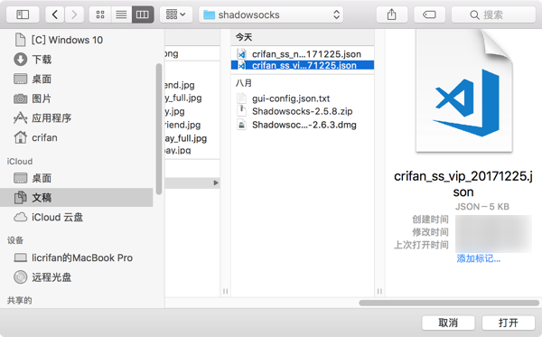

稍等，提示导入成功：

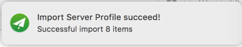

即可（一次性批量）导入对应（多个）服务器：

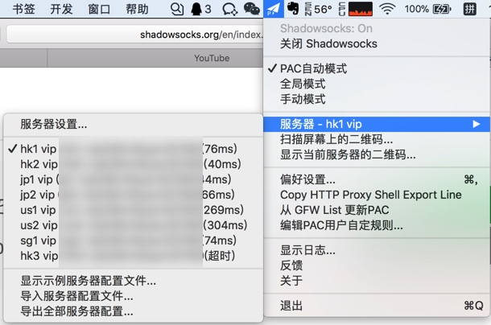

### 通过扫描二维码添加

前提是已经有了对应的服务器的二维码

对于之前去[shadowsocks.to](https://portal.shadowsocks.to/)去购买了ss服务后，可以通过后台管理页面中找到对应二维码。

此处去登录shadowsocks.to的后台管理页面，点击二维码：

会弹出二维码：

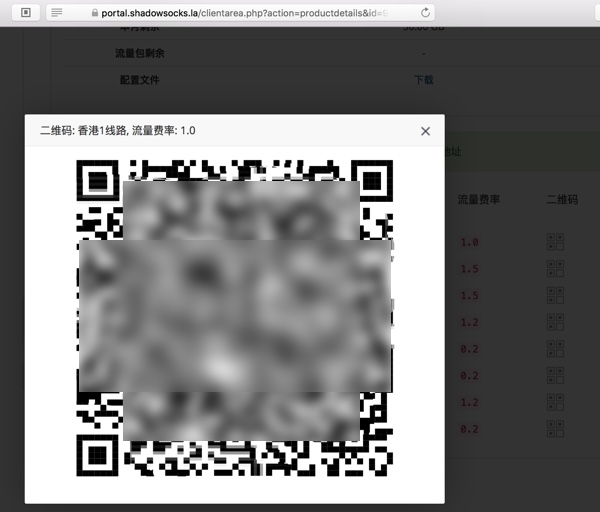

然后点击`ShadowsocksX-NG的菜单` -> `扫描屏幕上的二维码`

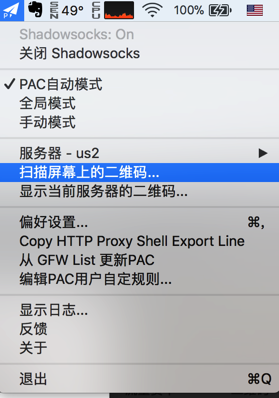

会自动识别屏幕上（刚才页面中弹出的）二维码，扫描成功后会提示：

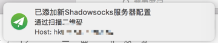

如此，每个服务器都点击一下对应二维码，用Shadowsocks-NG去扫码，即可添加对应服务器。

### 手动输入服务器的域名，密码，加密方式等信息

点击 `服务器 - xxx` -> `服务器配置`

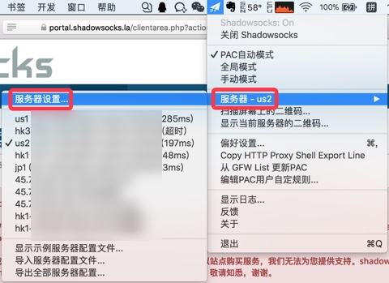

会弹出设置界面，点击左下角的加号➕，然后填入对应配置信息：

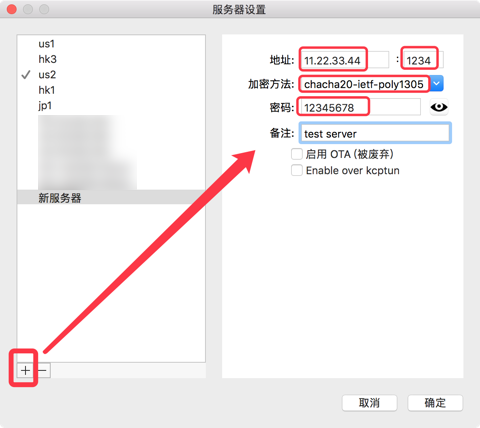

* 地址：[必填]服务器的IP或域名地址
  * 对应着shadowsocks.to提供的：`节点服务器地址`
* 端口：[必填]端口号
  * 对应着shadowsocks.to提供的：`服务端口`
* 加密方法：[必填]（现在最新的加密方法是）`chacha20-ietf-poly1305`
  * 对应着shadowsocks.to提供的：`加密方式`
* 密码：[必填]密码
  * 对应着shadowsocks.to提供的：`登录密码`
* 备注：[选填]
  * 自己填个自己觉得容易识别的好记的名字
  * 比如： hk1

然后点击确定。

用同样方法，一个个的去添加其他的服务器配置。

## ShadowsocksX-NG其他使用相关的配置

在添加了ss的服务器之后，接着去介绍如何使用ShadowsocksX-NG客户端。

### 打开/启用Shadowsocks

先去打开SS的客户端，选择`打开Shadowsocks`

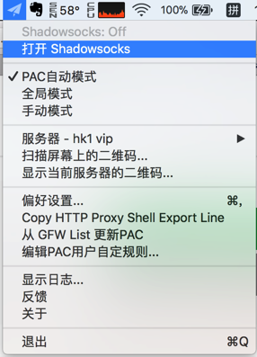

如此，即可去畅游互联网了，可以去打开本来无法访问的而现在可以访问的，比如：

https://www.youtube.com

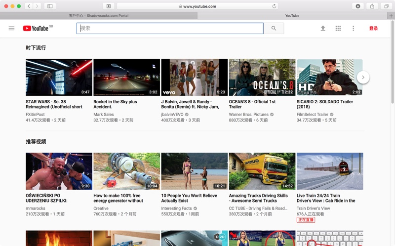

当然，下面还是可以去根据需要去更改对应的设置的：

### 选择工作模式

如果不想要看下面的模式的详细解释，那么直接使用默认的`PAC自动模式`即可。

关于不同工作模式的解释：

* `PAC自动模式`
  * 让Shadowsocks-NG去（根据设置中的GFW List）自动识别在打开网页时，是否需要翻墙
    * **推荐：普通小白用户使用此模式**
    * 比如打开国内的百度，腾讯，网易等网站，不需要翻墙
    * 比如打开国外的google，youtube等需要翻墙
  * 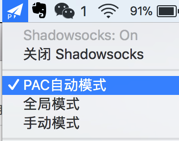
* `全局模式`
  * 强制对于所有打开的网页都是用翻墙
    * 优点和使用场景：对于部分页面，有些网页用自动模式打不开，则可以尝试全局模式，往往可以打开
    * 缺点：如果对于本身无需翻墙的国内网站，比如百度也强制翻墙的话，访问速度可能会降低
* `手动模式`
  * 提示：一般人很少用
  * 设置为手动模式后，需要自己去`编辑PAC用户自定规则`，添加自己定义的规则，决定哪些页面翻墙，哪些页面不翻墙。

### 选择用哪个服务器去翻墙

在添加了多个服务器后，可以点击 `服务器 - xxx` -> 去选择切换为自己需要的服务器：

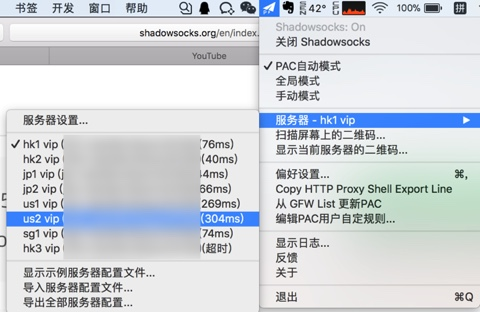

即可切换到（自己平时经常使用的，觉得速度和稳定性都不错的）us2的服务器：

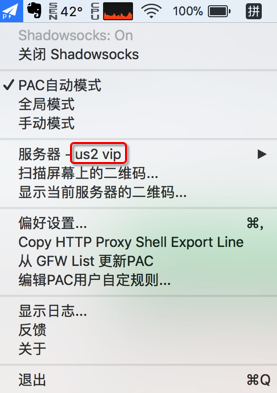

### 设置开机启动

想要每次开机自动启动的话，可以去：`偏好设置`

勾选上`开机启动`

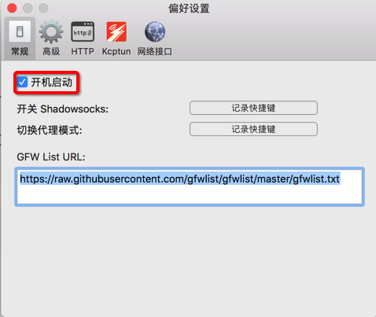

### 把当前所使用的ss服务器信息分享给别人

如果想要把当前你正在使用的ss的服务器的（地址，端口，密码，加密方式等）配置信息分享给别人，则可以：

选择`显示当前服务器的二维码`

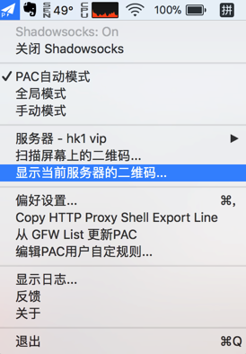

即可显示出当前服务器的二维码：

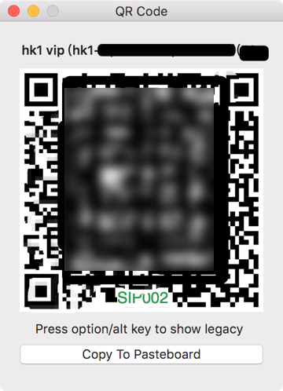

供其他人使用。

比如：别人用手机中的ss客户端去扫码添加该ss服务器到自己的客户端中。
