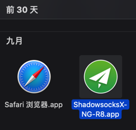
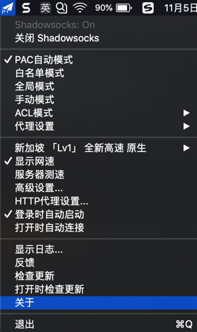
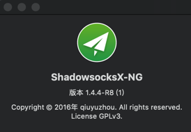
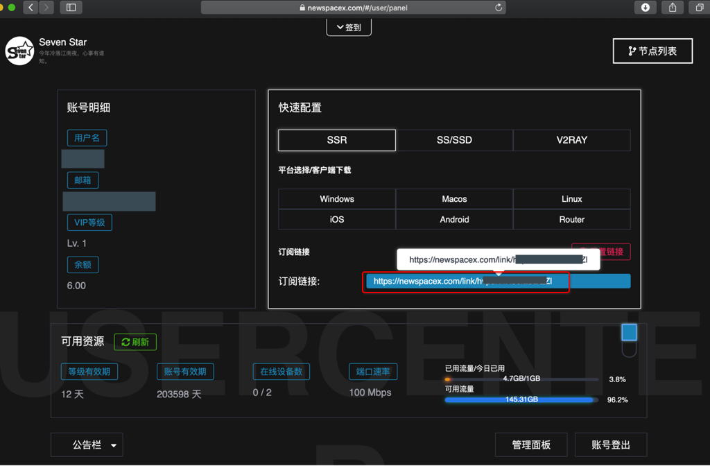
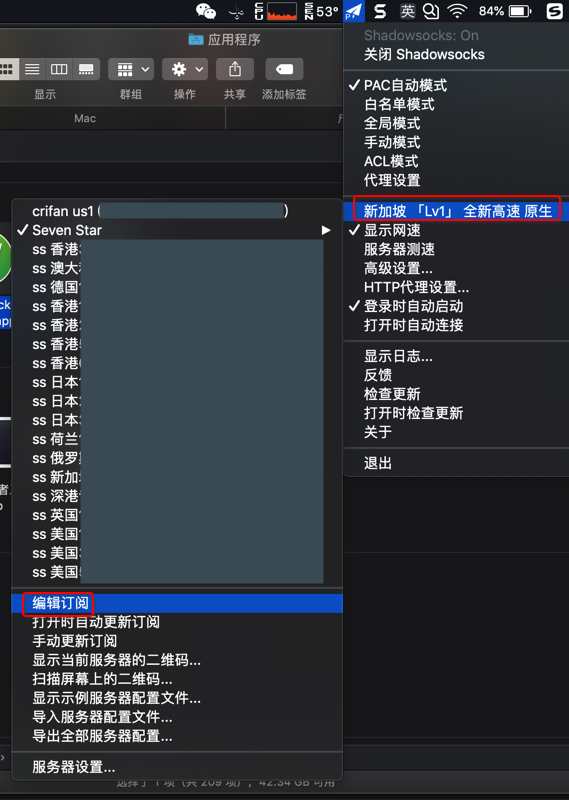
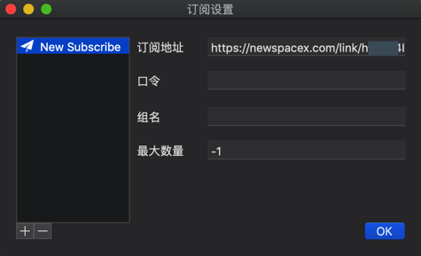
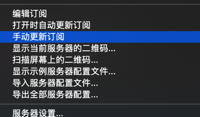
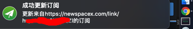
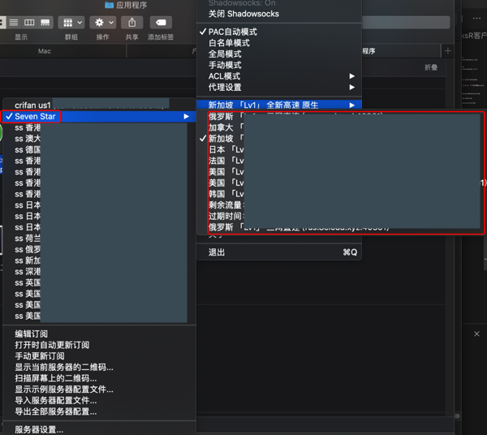

# Mac中的ShadowsocksR客户端

和Shadowsocks的客户端：

* Shadowsocks的Mac的客户端
  * ShadowsocksX
  * ShadowsocksX-NG

是类似的，Mac下的ShadowsocksR客户端只是后缀加上一个R：

* ShadowsocksX-R
  * github首页
    * https://github.com/yichengchen/ShadowsocksX-R
  * 客户端下载页面
    * https://github.com/yichengchen/ShadowsocksX-R/releases
      * 下载链接
        * https://github.com/yichengchen/ShadowsocksX-R/releases/download/ssr_1.38_2/ShadowsocksX-R.app.zip
* ShadowsocksX-NG-R
  * github首页
    * https://github.com/qinyuhang/ShadowsocksX-NG-R/
  * 客户端下载页面
    * https://github.com/qinyuhang/ShadowsocksX-NG-R/releases
      * 下载链接
        * https://github.com/qinyuhang/ShadowsocksX-NG-R/releases/download/1.4.4-r8/ShadowsocksX-NG-R8.dmg

## Mac版SSR客户端：ShadowsocksX-NG-R8

此处介绍Mac中如何使用`ShadowsocksX-NG-R8`：

### 下载和安装ShadowsocksX-NG-R8

从Github中下载：[Releases · qinyuhang/ShadowsocksX-NG-R](https://github.com/qinyuhang/ShadowsocksX-NG-R/releases)，得到的`ShadowsocksX-NG-R8.dmg`，双击去安装，即把其中的：`ShadowsocksX-NG-R8.app`拖动到`应用程序`=`Application`文件夹即可。

### 运行ShadowsocksX-NG-R8

安装后，从应用程序中找到应用：

双击启动，通过`关于`：

可以看到当前版本是：`1.4.4-R8 (1)`

### ShadowsocksX-NG-R8中添加服务器配置信息

之后导入服务器配置，其用法和之前的`Shadowsocks-NG`是类似的。

不过后来得知一个更加高效率的办法：

添加订阅后，更新订阅，即可批量导入服务器配置。

步骤如下：

找到你所购买的SSR的服务器配置的`订阅链接`

比如之前购买的 https://newspacex.com/ 中的订阅链接：

地址类似于：

`https://newspacex.com/link/xxxxxx`

然后去`编辑订阅`：

点击`+`，再输入订阅地址：

点击`OK`保存后，再去点击`手动更新订阅`：

很快就会收到通知，更新订阅成功：

即可更新获取到所有的服务器配置了：

如此，再去选择某个服务器节点，即可正常使用，实现科学上网。

小提示：可以借助于`服务器测速`，找出速度最快的服务器节点，然后用该节点科学上网。
