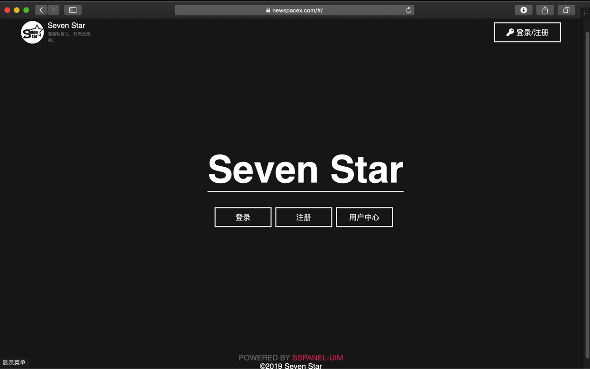
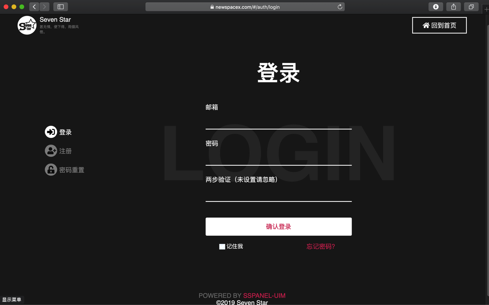
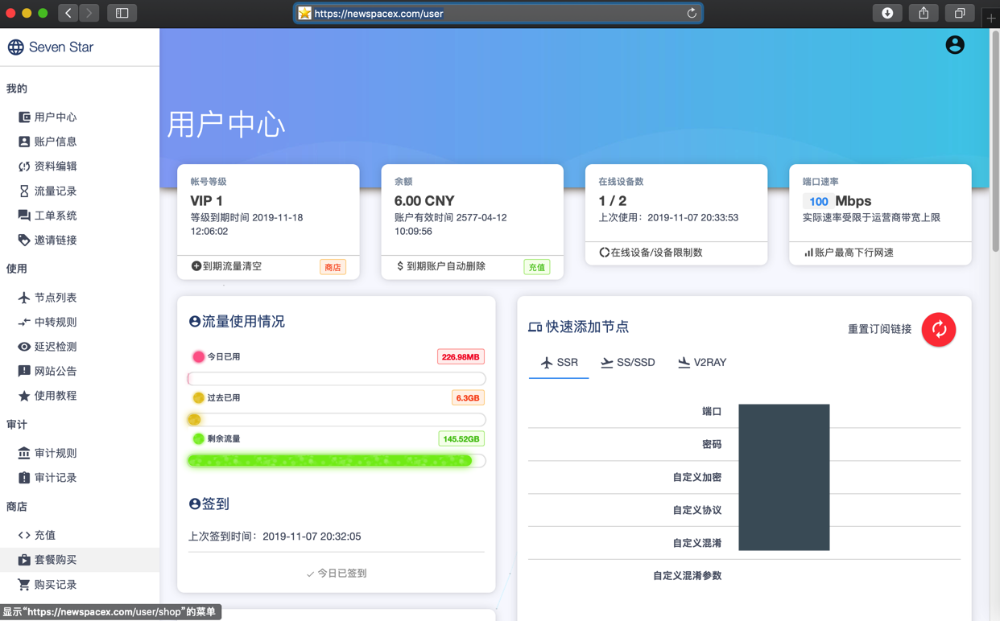
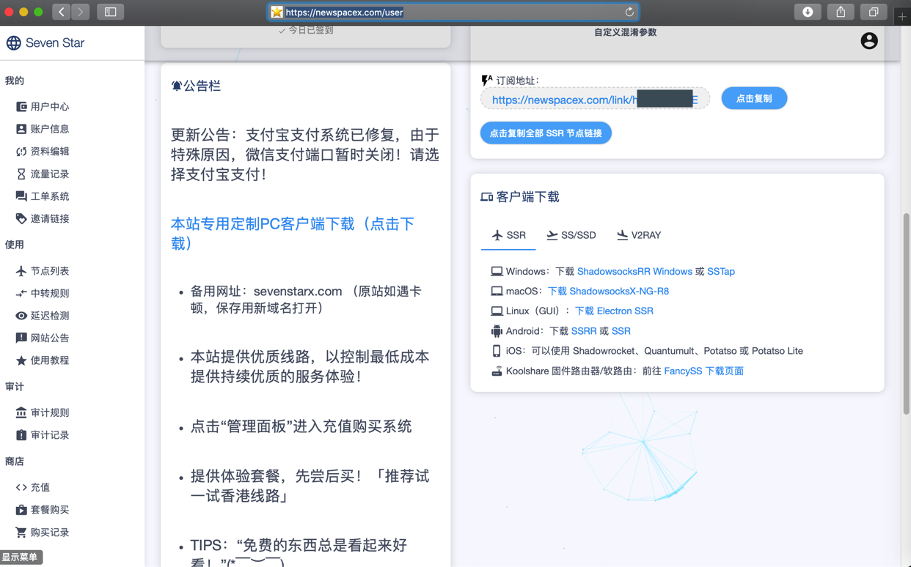
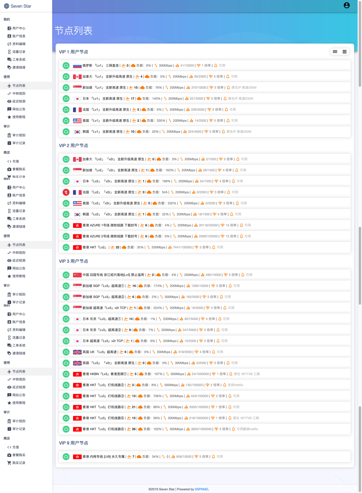
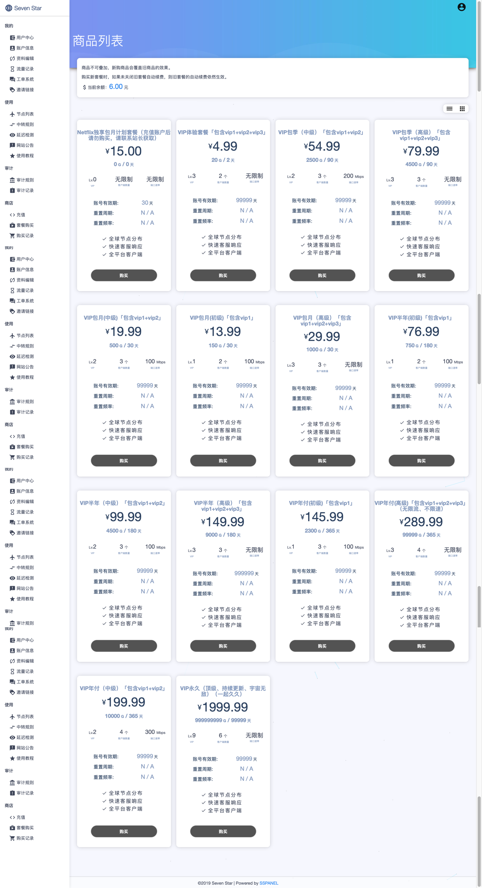
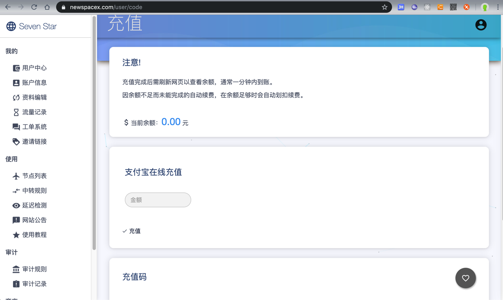
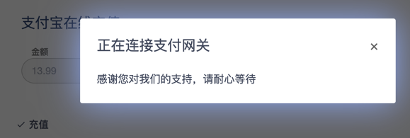
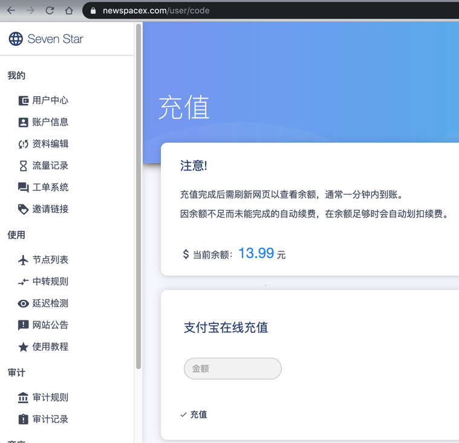
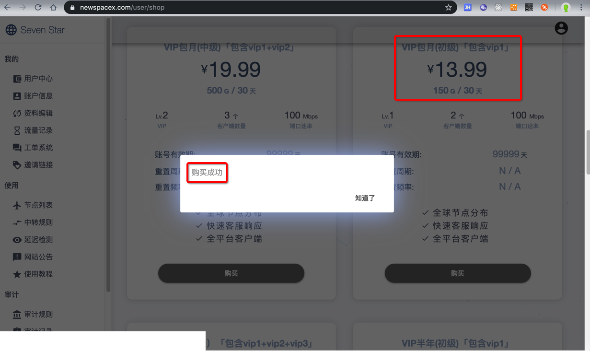

# 购买newspacex.com的SSR或V2Ray服务

之前常用的 shadowsocks.com 最近不可用了。

无奈去找别家SS（和，或 V2Ray的）提供商。

后来经别人推荐，找到了：

[Seven Star](https://newspacex.com/)

https://newspacex.com/

可以去购买到：

* SSR
* V2Ray

等配置，配合对应的客户端，比如：

* Mac中的
  * `ShadowsocksX-NG-R8`
  * `V2RayU`

即可科学上网。

## 购买 newspacx.com 服务的过程

### 注册账号

去主页

https://newspacex.com/

中的注册页面

https://newspacex.com/#/auth/register

去注册账号。

### 登录

注册后，进入登录页去登录

https://newspacex.com/#/auth/login

输入邮箱和密码，点击`确认登录`。

登录后，默认进入个人面板：

https://newspacex.com/#/user/panel

### 切换到管理面板=个人中心

个人面板的界面虽然简洁，但是功能不够全面。

所以点击其中的`管理面板`，进入`左边带菜单`的个人主页：

https://newspacex.com/user

### 节点列表

接下来，就是去购买对应的套餐了。

不过由于后续套餐中会出现`vip1`、`vip2`、`vip3`等字眼，需要先搞清楚具体含义，才便于购买到合适自己的套餐。

点击`左边菜单`->`使用`->`节点列表`切换到节点列表页面：

https://newspacex.com/user/node

先说背景：

newspacex.com中所能购买到的服务器的节点，主要有2类：

* `SSR`=`ShadowsocksR`
  * 凡是没有标识的，都是`SSR`
* `V2Ray`
  * 标有`v2r`的，是`V2Ray`的节点

再来解释（后续要购买的套餐中的）`vip1`、`vip2`、`vip3`的含义：

* `vip1`：都没有标识
  * 都是`SSR`的节点
* `vip2`：部分标`v2r`，部分没标
  * 部分是`V2Ray`的节点
  * 部分是`SSR`的节点
* `vip3`
  * 部分是`V2Ray`的节点
  * 部分是`SSR`的节点

总体上，猜测是：vip的等级越高，节点质量越好，当然价格也越贵

即：`vip3`>`vip2`>`vip1`

当然，此处普通的科学上网查资料，`vip1`也足够用了

### 购买合适的套餐

点击`套餐购买`，进入页面

https://newspacex.com/user/shop

接着再去解释如何选择合适的套餐：

* （和我一样）想要先买个几天的服务试试效果的，可以购买：
  * VIP体验套餐「包含vip1+vip2+vip3」
    * 价格：4.99元
    * 有效期：2天
* 确定服务好用后，打算长期使用：则可以批量购买时间长点的套餐
  * 可选套餐有
    * 按月买
      * VIP包月(初级)「包含vip1」
      * VIP包月(中级)「包含vip1+vip2」
      * VIP包月（高级）「包含vip1+vip2+vip3」
    * 按季度买
      * VIP包季（中级）「包含vip1+vip2」
      * VIP包季（高级）「包含vip1+vip2+vip3」
    * 按半年买
      * VIP半年(初级)「包含vip1」
      * VIP半年（中级）「包含vip1+vip2」
      * VIP半年（高级）「包含vip1+vip2+vip3」
    * 按年买
      * VIP年付(初级)「包含vip1」
      * VIP年付（中级）「包含vip1+vip2」
      * VIP年付(高级)「包含vip1+vip2+vip3」（无限流、不限速）
    * 永久
      * VIP永久（顶级、持续更新、宇宙无敌）（一起久久）
  * 个人建议
    * 想省钱的，买最便宜的初级套餐就够用了
      * 对应套餐
        * `VIP包月(初级)「包含vip1」`，之后每月续费
        * 或直接按半年买 `VIP半年(初级)「包含vip1」`
        * 或直接按年买 `VIP年付(初级)「包含vip1」`
      * 特点
        * 只有`SSR`的节点
    * 想要同时用上`SSR`和`V2Ray`的节点
      * 那就买 中级的`包含vip1+vip2`的 或 高级`包含vip1+vip2+vip3`的节点（节点更多，速度更快？）
      * 可选套餐
        * VIP包月(中级)「包含vip1+vip2」
        * VIP包月（高级）「包含vip1+vip2+vip3」
        * VIP包季（中级）「包含vip1+vip2」
        * VIP包季（高级）「包含vip1+vip2+vip3」
        * VIP半年（中级）「包含vip1+vip2」
        * VIP半年（高级）「包含vip1+vip2+vip3」
        * VIP年付（中级）「包含vip1+vip2」
        * VIP年付(高级)「包含vip1+vip2+vip3」（无限流、不限速）
      * 特点
        * 既有`SSR`节点，也有`V2Ray`节点
    * 土豪，不差钱的，可以直接买永久有效的
      * VIP永久（顶级、持续更新、宇宙无敌）（一起久久）

#### 举例：购买套餐`VIP包月(初级)「包含vip1」`的过程

此处举例之前购买的`VIP包月(初级)「包含vip1」`的过程

注意：在购买之前，先要计算好对应的费用，充值后，再去购买，才可以。

此处打算购买`VIP包月(初级)「包含vip1」`费用是`13.99元`，所以先通过

`左边目录`->`商店`->`充值`

去充值页面去充值：

https://newspacex.com/user/code

输入要充值的金额：`13.99`元，点击`充值`：

充值成功后，`当前余额`中可以看到对应余额：

然后再回到

https://newspacex.com/user/shop

套餐购买 页面去购买对应套餐：

### 导入节点，使用服务

购买套餐后，即可获得相应的服务器节点的配置。

而关于如何在客户端中导入服务器配置。

SSR的原理，和之前介绍的SS的原理是一致的。

不过此处发现个更加方便的，就是直接通过订阅地址，去批量一次性导入全部节点配置。

详见后续的SSR的客户端的使用。比如：

[Mac中的ShadowsocksR客户端](http://book.crifan.com/books/scientific_network_summary/website/server_client_mode/ss_client/ssr_clients/ssr_mac.html)

### 续费

> #### warning:: 要在套餐过期之前及时续费
> 注意你的套餐的有效期
> 
> 记得在套餐过期之前，登录网站后台，去充值和续费，延长使用期限。
> 
> 否则（就像我之前一样）忘了续费，导致节点就不可用，就没法科学上网了。（还误以为是其他方面的问题，比如以为是服务器节点本身出了问题而不可用呢）
