# 购买 portal.shadowsocks.ch 的ss服务

ss的服务的提供商有很多，包括国内的和国外的。

其中我自己一直在用的，且觉得效果不错的是：

**最新地址**：

https://portal.shadowsocks.ch

## portal.shadowsocks.ch 简介

可以去 portal.shadowsocks.ch 这个网站上购买ss服务。

portal.shadowsocks.ch 背后对应的公司是：`Cat Networks Hong Kong Limited`

### shadowsocks 的官网地址由于`你懂的`原因更换多次，请使用最新地址

> #### warning::该公司的网址更换了多次
> * 最开始的网址是：https://www.shadowsocks.com
> * 可能是怕别人误解为`shadowsocks`的官网，所以换了地址：https://www.shadowsocks.la
> * 20180522 可能是防止被和谐，又换了地址：https://www.shadowsocks.to
>   * 同时支付的货币币种从`美元`改为了`澳元`
> * 后来又更换为现在的：https://portal.shadowsocks.nu/
> * 20190205 又换成了：https://secure.portal.shadowsocks.ch
> * 20190305 又换成了：https://secure.shadowsocks.ch
> * 20190410 又换成了：https://portal.shadowsocks.ch

### portal.shadowsocks.ch 的自己的声明

正因为此，所以才会看到，最新的网站portal.shadowsocks.ch中，官网挂出了声明，专门提醒这一点：

> To all visitors:
>
> We can only provide support for customers purchased service on our site. If you have not purchase our service yet, please go to the purchase section for more information.
>
> 我们仅能为在本站购买服务的客户服务，如果您在其他类似站点购买服务，我们无法为您提供支持。shadow-socks.org 和 shadowsocksvpn.com 等网站与我们**没有任何关系**，敬请知悉，谢谢。
>
> Thank you.

所以看到此文的人，搞清楚portal.shadowsocks.ch只是一家提供了ss服务的公司的网站即可。

### 这家shadowsocks的服务总结

优点：

* 节点多
  * 之前就有遍布世界各地的多个节点，比如 `香港`,`日本`,`美国`,`俄罗斯`,`英国`等节点
  * 后又陆续新增一些节点
    * 我们很高兴地宣布，香港 HK5 节点已加入所有（入门版、高级版和旗舰版）服务计划，流量倍率为 1。
    * 荷兰 NL1 节点已上线，拥有中国电信大带宽，倍率仅为 0.1，欢迎使用。
      * NL1 in The Netherlands is now live. With high throughput capacity and lower rate only at 0.1. Please enjoy.
* 服务稳定
  * 目前用了好几年了，除了国内某些特殊时期（其他家服务也被停了），一般都可以稳定上网

缺点：

* 流量用完时，没有及时有效的通知，导致不知何故被停，后来上了网站上才看到是流量超了
  * 详见：[【已解决】shadowsocks突然无法使用后来发现是流量用完了](http://www.crifan.com/shadowsocks_suddenly_not_available_then_found_quota_run_out)
* 主页地址更换后，没有（比如通过邮件）及时有效的通知
  * 都是自己后来去官网后才看到通知。。。

## 购买地址

对应的，portal.shadowsocks.ch的最新的注册+登录+购买的地址是：

https://portal.shadowsocks.ch

## 购买 https://portal.shadowsocks.ch 的ss服务的过程

> #### note:: 下面的内容是基于旧域名 shadowsocks.to
> 下面的购买步骤的截图和地址都是基于旧地址 shadowsocks.to
>
> 请自行更换为最新的地址：https://portal.shadowsocks.ch

登录地址：[Client Area - Shadowsocks.com Portal](https://portal.shadowsocks.nu/)

会进入：

https://portal.shadowsocks.nu/cart.php

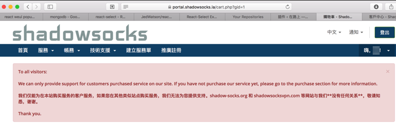

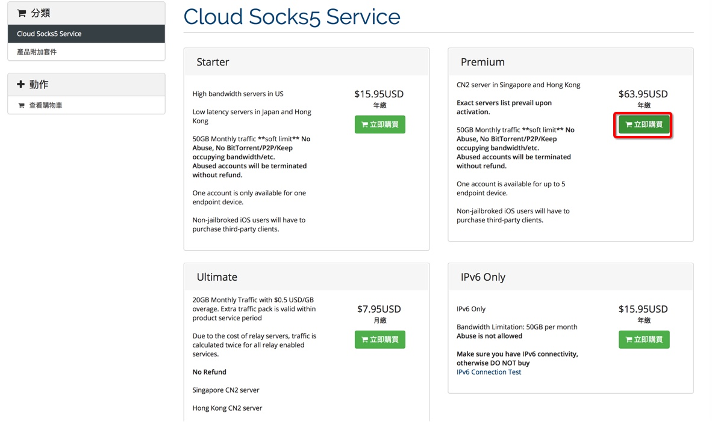

套餐说明：

* 对于个人：买Starter基本够用了
  * 流量：每月50G，足够一般的使用了
  * 人数：限制只能一个人用
    * 但是可以用在自己多个终端设备上
      * 比如桌面端的Mac和iOS或Android的手机上
* 对于多个人/小公司：可以选购Premium
  * 流量：也是50G，多人共享
  * 人数：最多同时有5个人使用
    * 其实只是理论上限制任意一个时刻，不能超过5个人
    * 所以平时偶尔及时稍微多点人，比如6个，7个之类的用，估计也没啥影响，也是可以继续用的

此处购买的是Premium的套餐：

> Premium
>
> CN2 server in Singapore and Hong Kong
>
> Exact servers list prevail upon activation.
>
> 50GB Monthly traffic **soft limit** No Abuse, No BitTorrent/P2P/Keep occupying bandwidth/etc.
>
> Abused accounts will be terminated without refund.
>
> One account is available for up to 5 endpoint device.
>
> Non-jailbroked iOS users will have to purchase third-party clients.

点击对应套餐后，进入：

https://portal.shadowsocks.to/cart.php?a=confproduct&i=0

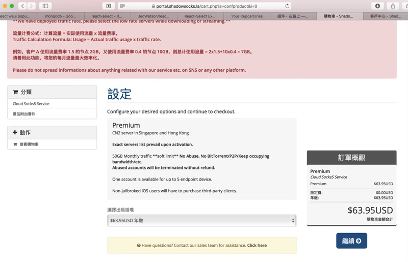

然后进入结账页面：

https://portal.shadowsocks.to/cart.php?a=view

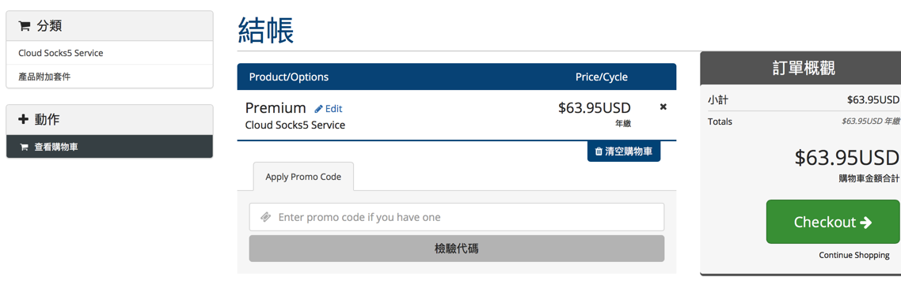

https://portal.shadowsocks.to/cart.php?a=checkout

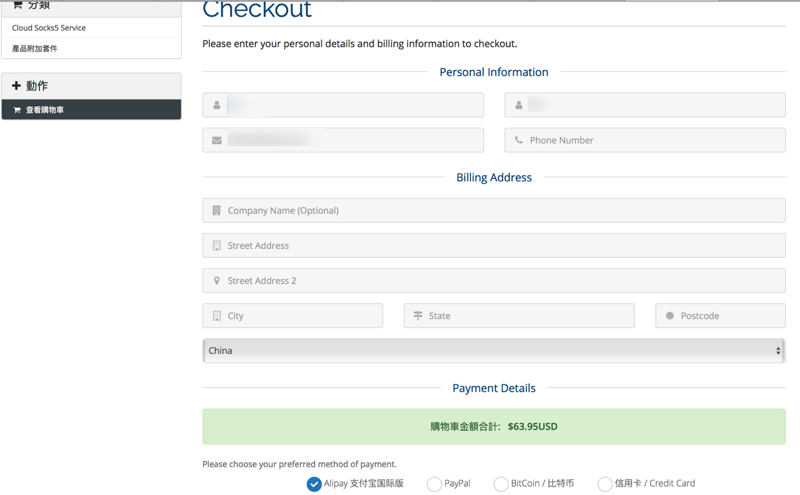

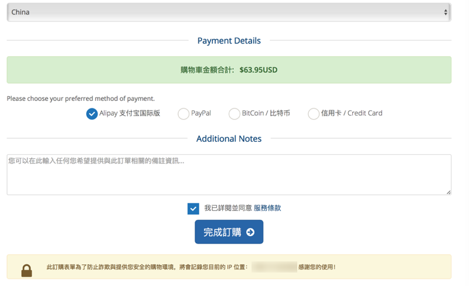

然后去用支付宝支付：

https://portal.shadowsocks.to/viewinvoice.php?id=9167982

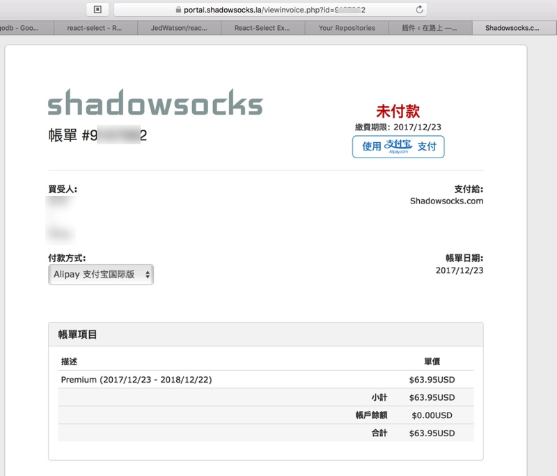

https://excashier.alipay.com/standard/auth.htm?auth_order_id=exc_28fd84d9b84e46179109a55a4480065d

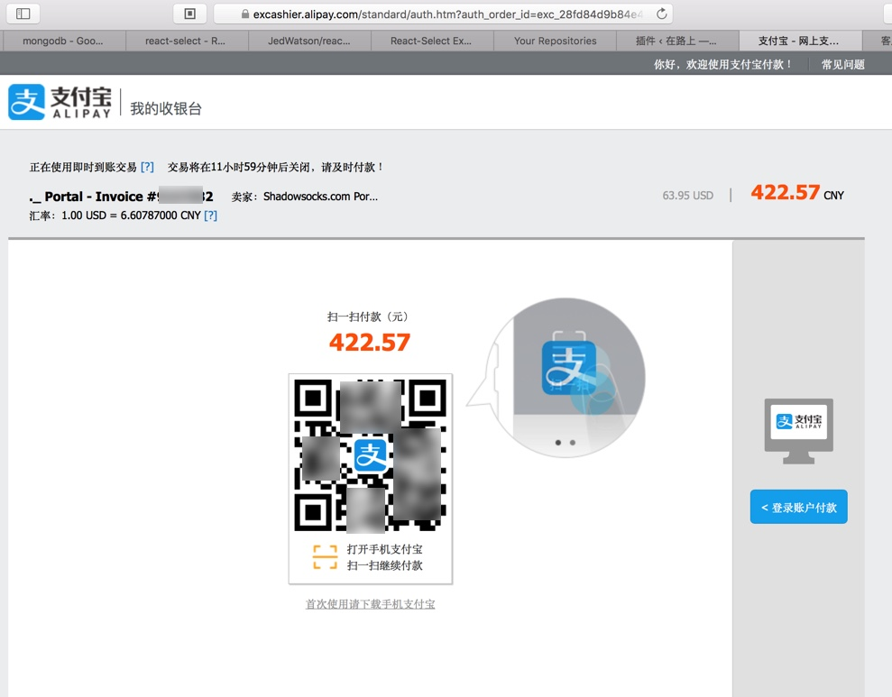

然后用支付宝去扫描支付即可。

支付成功后，会自动跳转回到商户页面：

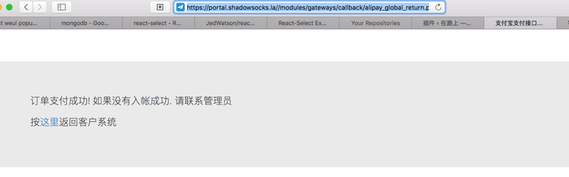

贴上此处支付后支付宝的交易信息：

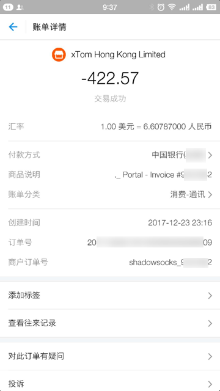

然后回到shadowsocks.to中，进去：

https://portal.shadowsocks.to/clientarea.php

可以从：`服务` -> `我的服务`：

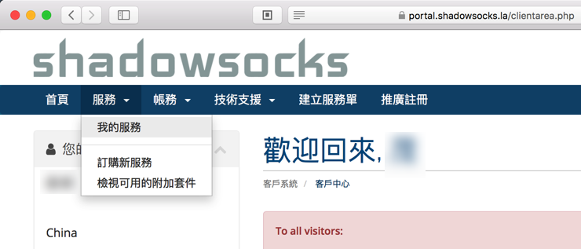

中找到已购买的服务：

https://portal.shadowsocks.to/clientarea.php?action=services

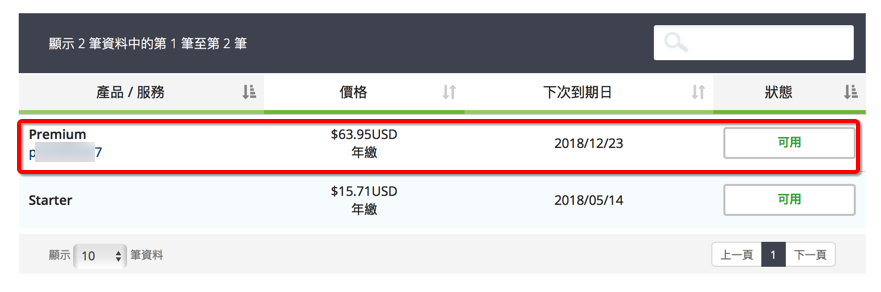

点击后，进入服务详情页：

https://portal.shadowsocks.to/clientarea.php?action=productdetails&id=993287

然后可以看到对应的信息：

（1）购买的服务的基本描述

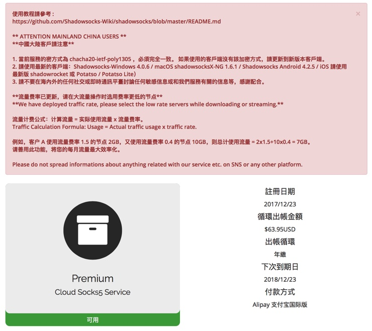

（2）ss的配置信息

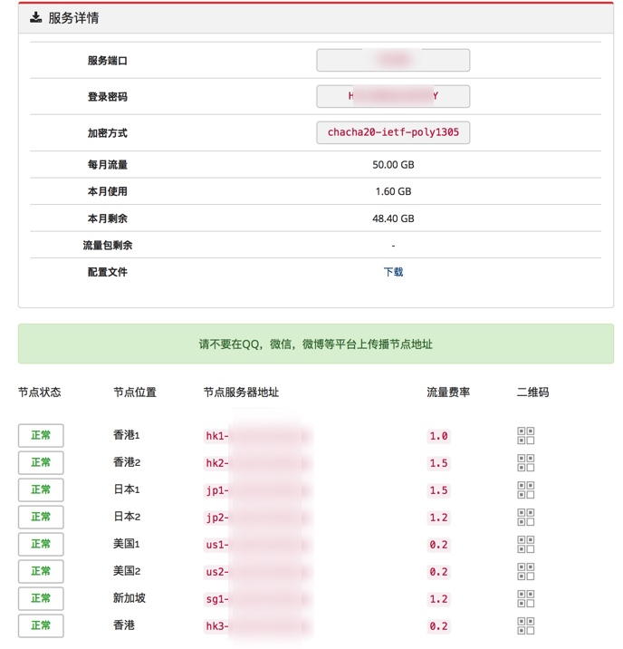

## shadowsocks.to中ss的配置说明

对此处的ss的配置信息解释一下：

* 服务端口：ss的客户端中用到的配置**端口号**
* 登录密码：ss的客户端中用到的配置**密码**
* 加密方式：ss的客户端中用到的配置**加密方式**
* 流量信息：
  * 每月流量：每月共有多少流量供你使用
  * 本月使用：当前用了多少
  * 本月剩余：还剩多少
* 配置文件：
  * 可以点击**下载**出现弹框，可以下载Windows和Mac的ss客户端的配置文件
* 服务器列表
  * 会列出各个可用的服务器
  * 主要包括了：
    * 节点服务器地址：就是服务器的IP或域名 -> ss的客户端中用到的配置**服务器地址**
    * 流量费率：不同的服务器
      * 这个费率是后来才支持的功能
      * 估计是为了平衡不同服务器的压力而设计的
    * 二维码：ss可以通过利用自带的扫描功能，扫描此二维码而自动添加该服务器的配置

### 加密方式

shadowsocks.to中：

* 现在采用最新的加密方式：`chacha20-ietf-poly1305`
  * 之前旧的加密方式是(最常见，但是不是足够复杂和安全的)：`aes-256-cfb`
    * 之所以换加密方式是因为：前不久国家的`20-1 大`期间查的严，各种ss和VPN都被干掉了，所以才升级为更安全的加密方式

### 配置文件

点击**配置文件**的**下载**，可以弹出对应下载不同配置的页面：

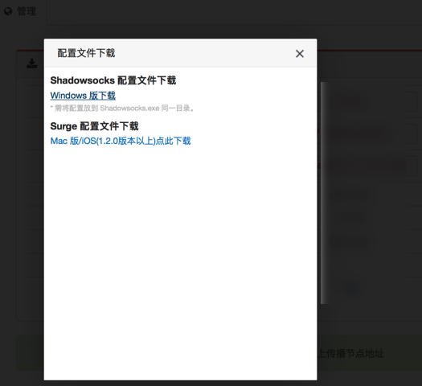

### 流量费率

之前没有流量费率这一说的。最新加入了流量费率。

官网的解释是：
> 流量费率已更新，请在大流量操作时选用费率更低的节点。
>
> 流量计费公式：计算流量 = 实际使用流量 x 流量费率。
>
> 例如，客户 A 使用流量费率 1.5 的节点 2GB，又使用流量费率 0.4 的节点 10GB，则总计使用流量 = 2x1.5+10x0.4 = 7GB。
>
> 请善用此功能，将您的每月流量最大效率化。

换句话说：

对于此处流量费率比较低的几个服务器：

美国1/美国2/香港 都是0.2，而本身购买的服务器的流量是50G，如果平时：

* 美国1/美国2/香港 这三个服务器都是可以稳定上网翻墙的话
* 且你自己一直都是用这三个服务器（之一）去翻墙上网的话

相当于你购买了50G /0.2=250G的流量了。

### 二维码

点击对应的按钮，可以出现二维码，而其他客户端（比如Mac中的ShadowsocksX-NG，Android手机中的影梭等）可以去扫码添加此ss服务器的配置信息，实现快速添加配置的效果。

具体的操作过程，详见后面的详细解释。
