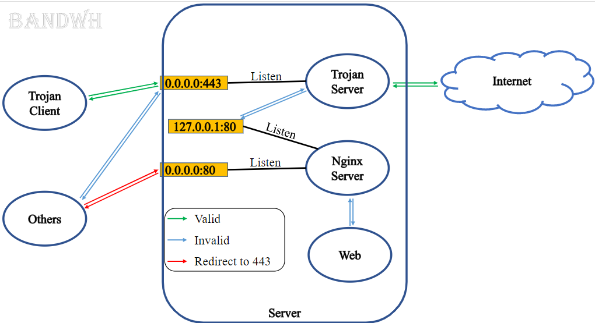
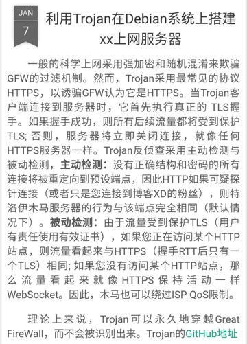

# Trojan

Trojan可视为V2Ray的下一代技术。

目前是相对来说最保险，最不容易被检测出和被封掉的技术。

对于此技术的基本用法和思路，和ss、V2Ray一致，不多赘述。

* Logo
  * 
* 总体思路
  * 服务端
    * 自己搭建服务器或买第三方的服务
  * 客户端
    * 再去使用某个Trojan的客户端
    * 加上配置
      * 即可科学上网
* 原理概述
  * 
  * 
* Github
  * [GitHub - trojan-gfw/trojan: An unidentifiable mechanism that helps you bypass GFW.](https://github.com/trojan-gfw/trojan)
* 客户端下载
  * PC端
    * Trojan-Qt5
      * [Releases · Trojan-Qt5/Trojan-Qt5 · GitHub](https://github.com/Trojan-Qt5/Trojan-Qt5/releases)
    * TrojanX
      * [Releases · JimLee1996/TrojanX · GitHub](https://github.com/JimLee1996/TrojanX/releases)
